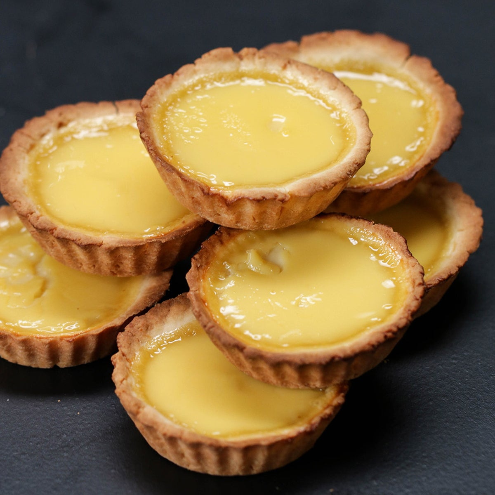

# Egg Tart Recipe

This recipe will guide you on how to make delicious and classic egg tarts that are perfect for dessert or snacks. Follow the steps below and enjoy your freshly baked egg tarts!

    
### Ingredients
- 2 cups all-purpose flour
- 1/2 cup **unsalted butter**, chilled and cubed
- 1/4 cup granulated sugar
- 1/4 teaspoon salt
- 3 **egg yolks**
- 1/2 cup milk
- 1/2 cup heavy cream
- 1/3 cup granulated sugar
- 1/2 teaspoon vanilla extract

### Equipment
- 12-cup muffin tin
- Rolling pin
- Mixing bowls
- Whisk
- Wooden spoon
- Measuring cups and spoons

### Instructions
- Preheat your oven to *375°F (190°C)*.
- In a mixing bowl, combine the flour, cubed butter, sugar, and salt. Mix them together until the mixture is crumbly.
- Add one egg yolk into the mixture and stir it with a wooden spoon.
- Continue adding the remaining egg yolks one at a time, and stir until the mixture forms a dough.
- Knead the dough on a floured surface until it becomes smooth.
- Divide the dough into 12 equal parts and press each part onto the muffin tin cups.
- Prick the bottom of the crust with a fork to prevent it from puffing up while baking.
- Bake the crust for 15 minutes or until it turns golden brown.
- In another mixing bowl, combine the milk, heavy cream, sugar, and vanilla extract. Whisk the mixture until the sugar is dissolved.
- Strain the mixture into a jug or bowl.
- Remove the muffin tin from the oven and pour the mixture into the crusts, filling them 3/4 full.
- Reduce the oven temperature to *350°F (180°C)* and bake the egg tarts for 20-25 minutes, or until they are set.
- Remove the egg tarts from the oven and let them cool for a few minutes before removing them from the muffin tin.
- Serve and enjoy!

### Tips
1. Make sure your butter is chilled before you mix it with the dry ingredients. This will make it easier to cut into small pieces.
2. When kneading the dough, avoid overworking it. Overworked dough can result in tough egg tarts.
3. Straining the milk mixture will remove any lumps or impurities, resulting in a smoother texture for your egg tarts.
4. If you have any leftover filling, you can pour it into ramekins and bake it along with the egg tarts for a crustless dessert.

### This is a LOCAL change :)
line 2 changed remotely

last line changed locally
### This is a REMOTE change :O
